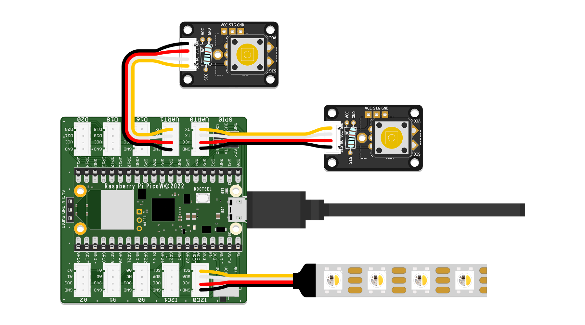

# Reaction Game

This beginner-friendly uses two [tactile switches](../components/tactile-switch/tactile-switch.html) and an [RGB LED strip](../components/led-components/led-components.html) to create a simple but fun two-player reaction game. It allows you to gain practical experience with basic programming logic, as well as using input and output components.


## Basic Logic & Setup

1. **Connect a button** to GPIO pin GP1 for the red player.
2. **Connect a button** to GPIO pin GP5 for the blue player.
3. **Connect the NeoPixel LED strip** (or compatible RGB LED) to GPIO pin GP9.
4. **Plug in your microcontroller** (e.g. Raspberry Pi Pico) and connect it to your PC.



The game starts automatically when powered up. After a short, randomized delay, the LED lights up white, signalling to both players to press their button as quickly as possible. The first player to press wins the round. The LED flashes in the color of the respective player to indicate the winner of the round. After a short pause, a new round begins.

## Code

Below is the complete code for a basic reaction game using two digital inputs (buttons) and an RGB LED for output. Use this as a starting point for your own logic and extensions.

```python
# --- Imports
import digitalio  # Digital input/output control
import board      # Board pin definitions
import neopixel   # Chainable RGB LED control
import time       # Time-related functions (delay, timers)
import random     # Generate random numbers for delay

# --- Variables

# Initialize buttons as digital inputs
red_button = digitalio.DigitalInOut(board.GP1)
red_button.direction = digitalio.Direction.INPUT
blue_button = digitalio.DigitalInOut(board.GP5)
blue_button.direction = digitalio.Direction.INPUT

# Initialize NeoPixel RGB LED strip on GP9 with 6 LEDs
led_pin = board.GP9
num_leds = 6
leds = neopixel.NeoPixel(led_pin, num_leds, auto_write=False, pixel_order=neopixel.GRB)

# Define RGB colors for LED indications
LED_OFF = (0, 0, 0)          # LEDs off
LED_WHITE = (255, 255, 255)  # White light to signal "Go!"
LED_RED = (255, 0, 0)        # Red light for Red player's win
LED_BLUE = (0, 0, 255)       # Blue light for Blue player's win

# Initialize timer variables
countdown_time = 0
countdown_start = 0

# Define game states
STATE_COUNTDOWN = "countdown"
STATE_WAIT_FOR_PRESS = "waiting_for_press"
STATE_WIN = "win"
current_state = STATE_COUNTDOWN

# --- Functions

def set_led_color(color):
    """Set all LEDs to the given RGB color."""
    leds.fill(color)
    leds.show()

def start_countdown():
    """Start random countdown between 3 and 7 seconds."""
    global countdown_time, countdown_start
    countdown_time = random.randint(3, 7)
    countdown_start = time.monotonic()
    print("Get ready...")

def countdown_finished():
    """Check if countdown timer has finished."""
    return time.monotonic() - countdown_start >= countdown_time

# --- Setup

# Turn off LEDs initially
set_led_color(LED_OFF)

# Start the countdown timer
start_countdown()

current_state = STATE_COUNTDOWN

# --- Main Loop

while True:
    if current_state == STATE_COUNTDOWN:
        # Wait until random delay ends
        if countdown_finished():
            set_led_color(LED_WHITE)  # Signal "Go!" with white LEDs
            print("Go! Press your button now!")
            current_state = STATE_WAIT_FOR_PRESS

    elif current_state == STATE_WAIT_FOR_PRESS:
        # Wait for either player's button press
        if red_button.value:
            print("Red wins!")
            set_led_color(LED_RED)
            win_time = time.monotonic()
            current_state = STATE_WIN
        elif blue_button.value:
            print("Blue wins!")
            set_led_color(LED_BLUE)
            win_time = time.monotonic()
            current_state = STATE_WIN

    elif current_state == STATE_WIN:
        # Keep state for 3 seconds, then restart game
        if time.monotonic() - win_time > 3:
            set_led_color(LED_OFF)
            start_countdown()
            current_state = STATE_COUNTDOWN

    time.sleep(0.01)  # Small delay to reduce CPU usage

```

{:.highlight}
The original inspiration of this reaction game code can be found [here](https://id-studiolab.github.io/Digital-Interfaces/assignments/01-reaction-game-discover/).


## Suggestions & Variations

If you got the basic game running and are looking for a challenge, here are some ideas on how to take it further:


- Display winner on a separate LED or on a display
- Add sound effects ([buzzer](../components/piezo-buzzer/piezo-buzzer.html) or [speaker](../components/audio-amp-speaker/audio-amp-speaker.html))
- Replace buttons with other types of sensors and define new interactions that work with those
- Make it multiplayer by adding more buttons and LED colors
- Display reaction time or keep a high score
- Add new rules and behaviours to the game

{:.note}
PenguinTutor developed an [advanced 4-player version](https://www.youtube.com/shorts/2sUVWSIK9SU) you could explore!

---

[Back to Overview](./){: .btn }
