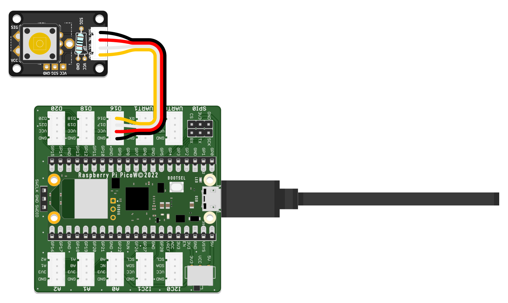

# Part 1 - Add an Input Component

The code in this tutorial is similar to the program you saw before. This time, you will write it yourself to better understand what you are doing.



1. Begin by connecting your Pi Pico W to the computer. We want to start this tutorial with an empty `code.py` file on your `CIRCUITPY` drive, so you need to delete or rename the existing one. For instance, you can use your computer’s file manager to give the old file from the last tutorial the name `blink_code.py`. Remember that your microcontroller will only execute code stored in a file named `code.py`.
2. Temporarily disconnect your Pi Pico W from the computer. Use a Grove cable to connect the Touch Sensor to the pin connector labeled **`GP16`** on the included pinout diagram, as shown in the illustration above.
3. Reconnect your Pi Pico W, then open Mu Editor. Click the `New` button in the toolbar at the top to create a new file. Then click `Save` to store your new file on the `CIRCUITPY` drive, naming it `code.py`.  
4. Follow along with the code example at the bottom of this page by beginning your program with `import` statements. These inform your board about additional instruction sets your code needs to work. These instruction sets are called [libraries](../../glossary/glossary) or [modules](../..glossary/glossary). You need to import three modules: `board` tells your program about the pins available on your microcontroller and their names. `digitalio` contains functions necessary for working with digital inputs and outputs. `time` allows your code to use timing-related functionality.
5. To make the Touch Sensor you connected in step 2 work, you first need to create a container to store the data coming from the sensor. Such a container is called a [variable](../../glossary/glossary). Variables are created by assigning a name to something: From now on, `sensor` will store a `digitalio` [object](../../glossary/glossary) attached to pin **`GP16`**. In the following line of code, you define the value stored in `sensor` to be read from an `INPUT`, not written to an output.
6. As before, you end your program with a `while` loop whose condition is set to `True`. Inside this endlessly repeating loop, you use a `print` statement to display the `sensor.value` in the `Serial Monitor` each time the code repeats. Using a sleep timer, you slow down the speed of the loop so as not to overwhelm Mu’s Serial Monitor with more messages than it can handle.

```python
import board
import digitalio
import time

sensor = digitalio.DigitalInOut(board.GP16)
sensor.direction = digitalio.Direction.INPUT

while True:
    print(sensor.value)
    time.sleep(0.1)
```

{:.note}
[Libraries](../../glossary/glossary) and [modules](../..glossary/glossary) contain code written by other people to fulfill specific tasks. Core modules, such as `board`, `digitalio`, and `time` provide functionality essential to working with your board. Therefore, they are already included in CircuitPython. In some cases, you may need to download additional libraries to add functionality, such as drivers for specific sensors, to your code. You can learn more about that subject by reading the chapter on CircuitPython Libraries in [Adafruit's guide](learn.adafruit.com/welcome-to-circuitpython/circuitpython-libraries). 

[Next Step](part-2){: .btn .btn-blue }